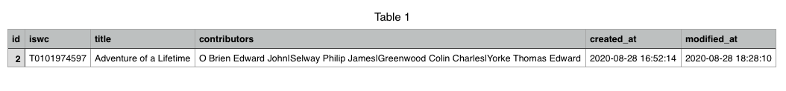

# works-single-view-api

This is the repository for the second part of the test assigned to me by BMAT. I used `flask` as web server exposing its api with the `flask-restful` module. The software is designed to work with the same database used in the first part of the assignment

## Dev Dependencies

- Python 3.7.7
- watchdog
- pandas
- numpy
- psycopg2

## Setup

1) Create a virtual environment

``` 
python3 -m venv <env_name> 
``` 

2) Activate it:

``` 
source app/<env_name>/bin/activate 
``` 

3) Install the dependencies in the requirements.txt file:
``` 
pip3 install -r app/requirements.txt 
``` 

4) (Optional) Set your own configuration in the app/config.py file; leave the defaults if you run the postgres image I provided

Launch it with the command:
``` 
python3 main.py 
``` 

## Usage

#### Musical Works Endpoint

GET http://localhost:5000/api/musical_works

RESPONSE
```javascript
[
    {
        "id": 1,
        "iswc": "T9204649558",
        "url": "http://localhost:5000/api/musical_works/T9204649558"
    },
    {
        "id": 2,
        "iswc": "T0101974597",
        "url": "http://localhost:5000/api/musical_works/T0101974597"
    },
    {
        "id": 3,
        "iswc": "T9214745718",
        "url": "http://localhost:5000/api/musical_works/T9214745718"
    },
    {
        "id": 4,
        "iswc": "T0046951705",
        "url": "http://localhost:5000/api/musical_works/T0046951705"
    }
]
```
GET http://localhost:5000/api/musical_works/T0101974597

RESPONSE
```javascript
{
    "id": 2,
    "iswc": "T0101974597",
       "contributors": [
           "O Brien Edward John",
           "Selway Philip James",
           "Greenwood Colin Charles",
           "Yorke Thomas Edward"
       ],
       "title": "Adventure of a Lifetime",
       "created_at": "2020-08-28 16:52:14",
       "modified_at": "2020-08-28 18:28:10",
       "download": "http://localhost:5000/api/musical_works/T0101974597/download",
       "upload": "http://localhost:5000/api/musical_works/T0101974597/upload"
}
```

GET http://localhost:5000/api/musical_works/T0101974597/download

RESPONSE




POST http://localhost:5000/api/musical_works/T0101974597/upload

Example of async request in Javascript with JQuery:
```javascript
var form = new FormData();
form.append("file", "/Users/biagio/Desktop/works_metadata.csv");

var settings = {
  "async": true,
  "crossDomain": true,
  "url": "http://localhost:5000/api/musical_works/T9204649558/upload",
  "method": "POST",
  "processData": false,
  "contentType": false,
  "mimeType": "multipart/form-data",
  "data": form
}

$.ajax(settings).done(function (response) {
  console.log(response);
});
```


RESPONSE
```javascript
{
    "message": "File works_metadata.csv uploaded successfully"
}
```

## Answers to Questions

1) <b>Imagine that the Single View has 20 million musical works, do you think your solution would have a similar response time?</b>
    <br/>
    Honestly, I don't have any experience with managing such a huge dataset. However, I can anticipate that the response time of my solution will be much slower, increasing the time required by the `SELECT` queries to fetch data and stressing the disk(s) hosting the database in the I/O operations

2) <b>If not, what would you do to improve it?</b>
    Even if I'm not an expert in database administration, I know that there are many ways to optimize a PostgreSQL database for this scenario (clustering, table partitioning, indexing etc) and they would all important to prevent the system from collapsing; anyway, I would consider to move all the queries to a text-based service like ElasticSearch, because they are designed to solve these problems specifically and improve the application' response time in a significant way
    
